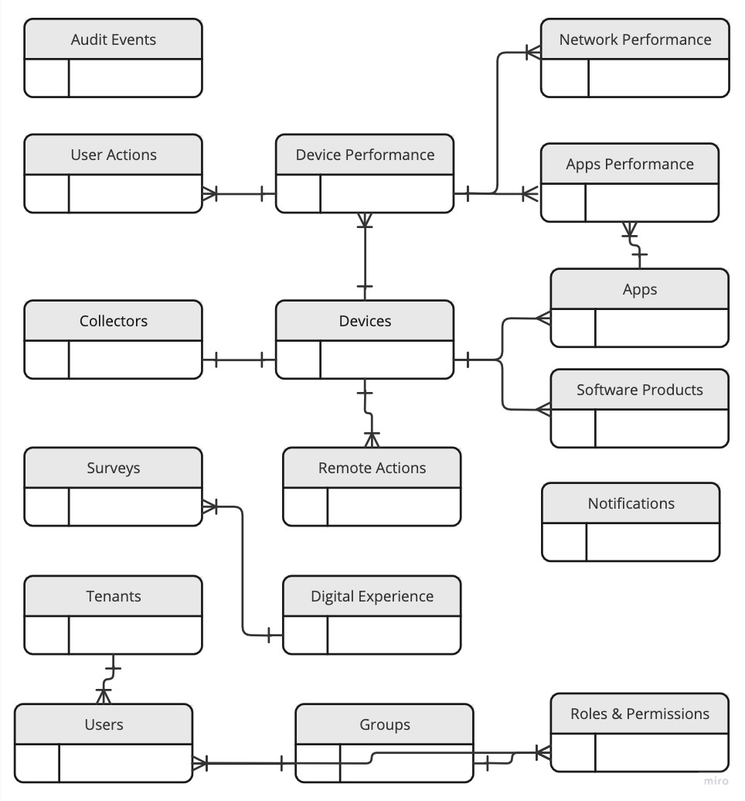
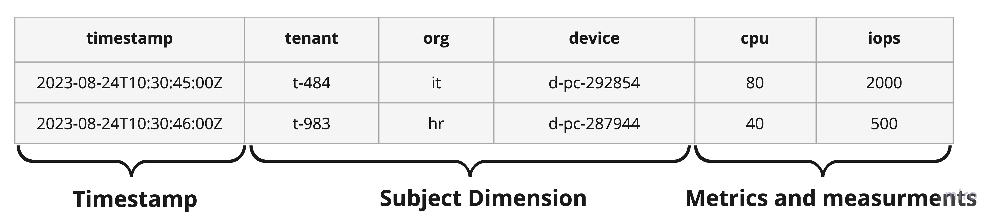
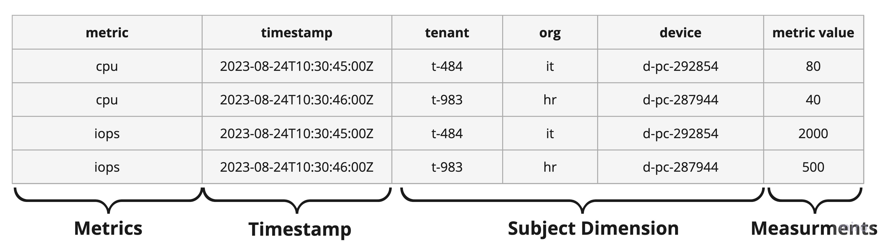
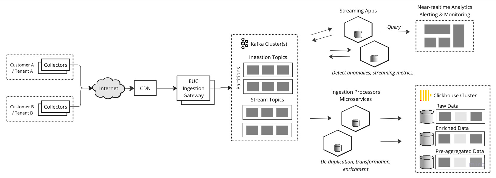
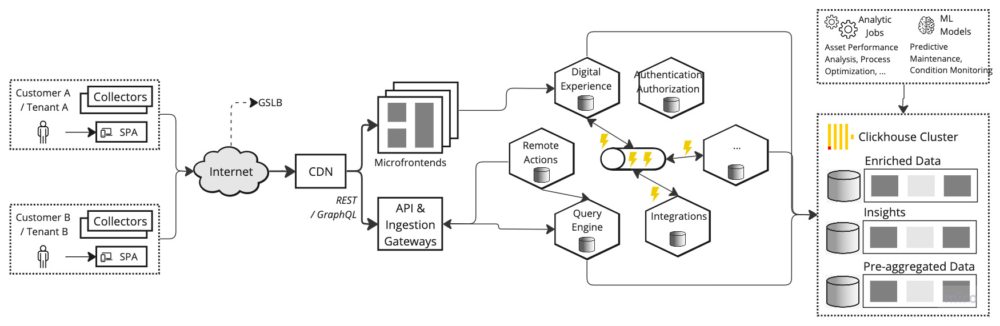
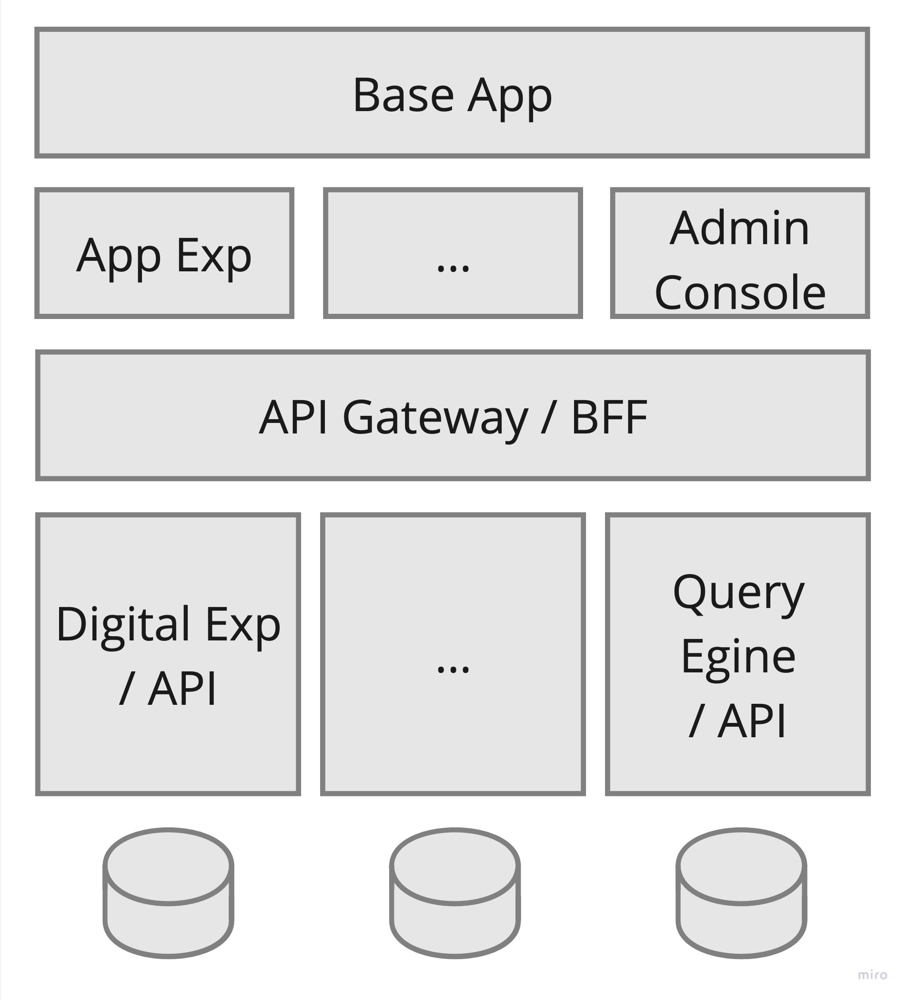
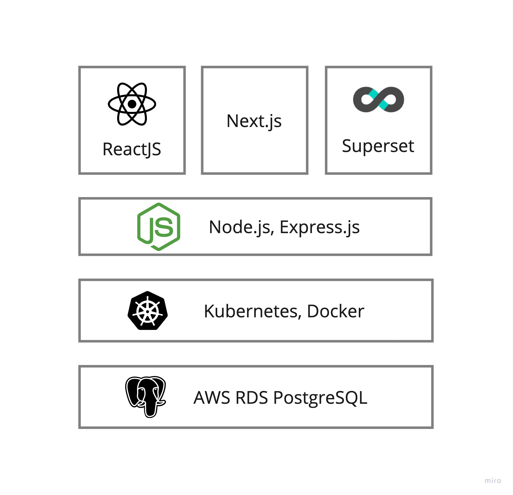
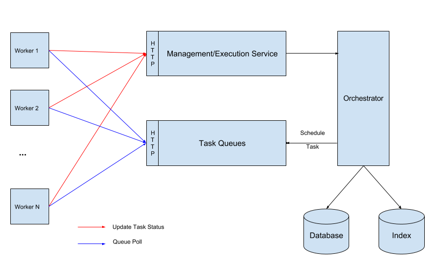

# 🔥 Nexthink Interview Assignment 🎉

> Refer to :globe_with_meridians: [My Github Repo](https://github.com/venkataravuri/nexthink-assignment/) for a latest assignment response. The document is composed using Github's Markdowns.

## 🚁 Quick Overview

This document captures **high-level solution architecture** of re-engineered and re-architected solution that replaces existing single-tenant monolith solution with a **:rocket: scalable, :wavy_dash: elastic & :office: a multi-tenant solution**.

- Explains :ferris_wheel: **To-Be Architecture** through various reference architecture models & views such as ```Functional Architecture, Technical Architecture, Deployment Architecture, Component Designs, Technology Choices and more```, each addressing unique concerns of various stakeholders & audience.
- Highlights how the proposed solution addresses limitations & constraints for current system.

Refer to :question: problem statement [Nexthink Architecture Quiz]() for current system contraints and goals of proposed solution.

‼️ **Disclaimer**

There are numerous ways to design systems, each with various approaches and plenty of alternatives. The methods I employed in this case take into account _industry-standard practices, tools, limitations in resources, and other factors_. Moreover **Architecture is about making "Trade-offs"** along the dimensions like scalability, reliability, throughput, cost-effectiveness and more. Proposed architecture accommodates best of everything.  

### 📚 Table of Contents
- [Assumptions](#assumptions) & [Out of Scope](#out-of-scope)
- [Current Solution Limitations & Constraints](#current-solution-limitations--constraints)
- [Architecture Goals](#-architecture-goals-for-to-be-solution)
- [Functional Analysis & Design](#-functional-analysis--design)
    - [Functional Requirements](h#-functional-requirements)
    - [Non Functional Requirements](#%EF%B8%8F-non-functional-requirements)
        - [Data Volumes & Traffic Projections](#%EF%B8%8F-data-volumes--traffic-projections-)
        - [Data Modelling](#data-modelling)
- [Solution Architecture](#-solution-architecture)
    - [Ingestion Subsystem Design & Components](#-ingestion-subsystem-components--design)
        - [Ingestion Gateway](#-ingestion-gateway)
        - [Streaming Apps & Near-Realtime Trends](#-streaming-apps--near-realtime-trends-analytics)
        - [Ingestion Processors (Microservices)](#ingestion-processors-microservices)
    - [Digital Experience Portals Subsystem Architecture](#-digital-experience-portal-subsystem-architecture)
      - [SPA Microfrontents](#spa-microfrontents)
        - [Microfrontends & Tech. Stack](#microfrontends--tech-stack)
      - [Business/Domain Services & APIs](#businessdomain-services--apis)
        - [Tenant Isolation](#tenant-isolation)
        - [Service-to-Service Communications](#service-to-service-communications)
        - [Technology Choices & Tech. Stack](#technology-choices--tech-stack)
     - [Data Analytics & Insights](#-data-analytics--insights)
	- [Data Analytics Jobs](#data-analytics-jobs)
- [Deployment Architecture]()
- [Security Architecture]()
	- [Authentication & Authorization](#authentication--authorization)
 	- [Privacy & Data Residency](#privacy--data-residency) 
- [References](#references)


#### Assumptions

> During the envisioning the solution, I made many assumptions and documented rationale behind those assumptions.

#### Out of Scope

Due to time constraints, following topics are considered as out of scope,

1. Data Migration & Cutover strategy could not be documented due to time constraints.
2. Security Architecture is partially articulated.
3. Machine Learning models & pipelines to detect anomalies and recommend actions are not captured due to time constraints.

#### Current Solution Limitations & Constraints

A quick recap of current system limitations,

1. A single-tenant system that cannot be scaled to workloads.
2. As a monolith system, parallel development is not possible and unable to rollout new features quickly (time-to-market).
3. System cannot cloud elasticity in cost-effective manner.

### 🚩 Architecture Goals for To-Be Solution

The overarching goals of re-architected solution are,

- **Multi-Tenant Model**: A true multi-tenant system with shared infrastructure across tenants with strong ```Tenant Isolation``` guardrails to deal with noisy neighbours while keeping data isolated.
- **Scalability & Elasticity**: Solution components should be horizontally scalable and leverage ```elasticity``` provided by underlying cloud platform. Should withstand burst workloads during peak usage hours.
- **Event-driven Interactions**: Solution components should be loosely-coupled for ```resiliency``` and independently rollout features with increased frequencies. Also should enable parallel development with multiple teams.
- **Resilient**: Solution component should be resilient to network glitches, hardware failure with 'no single-point failure' and be ```crash-tolerant``` with recoverability & ```fault-tolerant```.
- **Cloud Agnostic** - Leverage mix of cloud agnostic & could-specific services.
- **Security, Governance and compliance**: Adhere to global data localization privacy laws.

## 🌈 Functional Analysis & Design

The main actors of the system could be,
1. Organization employees
2. IT Help Desk Staff
3. IT Ops.
4. Privacy Officer & InfoSec Teams
5. Device & Peripheral Providers
6. System Administrators

### 🚞 Functional Requirements

Only architecture significant system use cases and features were analysed. The solution has below critical features for IT Help Desk and Ops. teams,

**Digital Employee Experience Features**: 
- Track a rich set of metrics like device health, OS, app performance, users, and network. Proactively identify issues, troubleshoot and remediate with automation. 
- Insight into employee experience across installed apps and OS. Quickly surface users, apps and devices with poor experience that need your attention.
- Gather employee sentiment through customized and contextual surveys. Get timely insights into overall employee experience beyond quantitative performance metrics, and set up workflows based on survey responses.

System Administrators should be able to,

**Workflow Orchestration**
- Orchestrate and automate IT tasks, resolve issues, and send user notifications.
- Automate incident management with contextual dashboards that surface diagnostic information relevant to the specific issue. 

**Actionable Insights**
Aggregate and correlate data from multiple sources across your digital workspace to visualize environment KPIs, understand trends and gain meaningful insights.

### ♨️ Non Functional Requirements

Following non-functional requirements have been highlighted as critical to to-be solution,

- **Scalability & Elasticity** - Components should be auto-scalable based on traffic patterns.
- **Tenant Isolation** - Data of each tenant is isolated and should have mechanism to deal with noisy neighbours.
- **Availability** - System components should be highly available across several geographies. _Is it 99.99% availability?_
- **Performance** - Services should have low-latency and support high-throuput. Should accommodate burst workloads during peak hours. 
- **Resiliency** - System component should be resilient to temporary glitiches and self-healing. Components should recover from crash
- **Privacy & Data Localization** - Should complaint to GDPR and other privacy governance rules.

RTO & RPO of the system services not specified, however it is assumed thety will be stringent as it is critical to businesses.

### ✈️ Data Volumes & Traffic Projections 🎢

Below is quick estimate of capacity and projected traffic volumes. This information will **help Infra & DevOps teams to size the infrastructure capacity** to coup peak traffic scenarios. Also acts as **inputs to Performance and Volume Testing** aka. Load Testing.

- Each collector captures, aggregates, and broadcasts daily about 1-2000 events totaling 10MB from each device.
- Our customers have between 10K and 500K installed collectors.
- 1000 customers for a total of 15 Million endpoints

```
Data volume per day 	~ (Data size per day by a collector) * (# of collectors) * (# no. of customers)
                    	~ 10 MB * 500 K * 1000 Customers
			~ 👊 4,768 TB (Or) 4.6 PB
```

> Note: It is unclear that data captured is compressed or not.

**🚖 Traffic Estimates**

It is assumed that employees are active for 8 hours per day and collectors transmit data when devices are active only. There a chances that several employees start their work at same time of the day, resulting peak traffic.

Assumption: 2000 events in a day ~ 2000 / 8 hours work ~ 250 per hour ~ 5 per min

| Device | Traffic per **min** | Y1 Growth |
| --- | --- | --- |
| 1 collector | 5 req-per-min | 6 req-per-min | 
| 500K Collectors | 👊 41k rps | 50k rps |
| 1000 customers Collectors | 🚀🚀🚀 41 million rps | 50 million rps |

### Data Modelling

A shared database & shared schema approach would be cost-effective solution for multi-tenant system with low maintenance. 

With this every domain entity should have TenantID attribute, resulting every table having tennant_id column that indicates the owner of the row.

Below ER diagram depicts few critical entities in the solution,



Entities such as device performance, app performance, network performance includes three classes of columns **time, dimensions and metrics**.
- Combination of **tenant-id & timestamp** column is the primary partition mechanism. 
- **Dimensions** are values that can be used to filter, query or group-by.
- **Metrics** are values that can be aggregated, and are nearly always numeric.

These entities can be ```modelled by data source``` over ```model by metrics```

- **Modelling by data source** - Measurements of all metrics of the same data source at a certain time point are stored in the same row.



- **Modelling by Metrics** - modelling by metrics, where each row of data represents a measurement of a certain metric of a data source at a certain time point.



> As **Clickhouse** underlying layer architecture adopts columnar storage and there is an index on each column, ```modelling by data source``` may be better.

> Storing multiple metric values on the same row may affect the query or filter efficiency on one of the metrics.

## 🏁 Solution Architecture

Solution architecture broken down into two streams, namely,

1. Ingestion subsystem
2. Digital Experiences subsystem 

### 🚀 Ingestion subsystem components & design

The subsystem components are designed to,
- Handle **write-heavy traffic** with **high concurrency**
- Ensure very **low-latency** and **high-throughput**
- Follows **Pub/Sub model** for scalability and handle **backpressure**
- Processing of events should be **idempotent** and **crash-tolerant**
- Resiliency when services' crashes

Ingestion mechanism supports in-steam trends/~~analytics~~ for SRE & Tech Ops teams to spot any anomalies and take corrective action.



Can't see diagram, click [Miro](https://miro.com/app/board/uXjVMsKyGeM=/?share_link_id=177577594401) to view diagram.

### Critical Components Role & Responsibilities

#### 🎌 Ingestion Gateway

Ingestion Gateway is a horizontally scalable bi-directional communication service to captures 'Collector Agent' emitter events/data, validates them and deliver to relevant Kafka topics to further processing. The validation includes,
1. Authenticate Collector Agents through Client Certificates or other credentials/token-based mechanisms.
2. De-compress, perform schema & semantic validation of Payloads along with JSON vulnerability checks.
3. Induce tracking/trace id (if not exists)
4. Rate-limits (may require **Redis with sliding-window pattern**)
   
- Gateway is also responsible to trigger remote actions on 'Collector Agents' when they are connected. 
- Collector Agent & Gateway ensure that events are delivered at-least once / exactly-once through re-try and producer tracking id & sequence id mechanisms. 
- Gateway uses Kafka cluster acts as buffer layer to sustain **Backpressure**
- Data can be batched to reduce round-trips.

Gateway can be designed as Cloud-Native application and scaled through Kubernetes HPA. Other alternative is leverage open-source Gateways and tailor their capabilities by building custom plug-ins and extensions.

#### Scaling to 50+ million events

Ingestion subsystem components should be extremely scalable to coup up with burst workloads with low latency.

Multiple isolated clusters are needed to reduce impact to all customers when things go wrong. Traffic distribution across these clusters can be done through geo-location, by tenant or combination of both.

To process high-volume feeds, 
- Gateway components are deployed to Kubernetes(K8s) cluster with horizontal Pod Autoscaler (HPA) based on throughput metrics.
- Majority of processing should be done in-memory with NO blocking I/O.

Processing of raw data is decoupled from capture for high-throughput. Backpressures due to downstream processing delays and database bottlenecks are handled through Kafka as buffer layer.

**Alternatives**: :rocket: :rocket: :rocket: For extreme low-latency & high-throughput processing ```[Disruptor](https://lmax-exchange.github.io/disruptor/user-guide/index.html) aka. Ring Buffer ``` pattern can be employed, but its too complex.

#### Scaling Kafka Cluster

- Have multiple isolated Kafka clusters over single large Kafka cluster to avoid impact entire customer base.
- Have more and more topic partitions for parallel processing with the In-Sync Replica set (ISR) set to at least 3 to avoid message losses during broker outages.
- Add brokers dynamically based on request throughput.

**Kafka Topic Strategy**
For parallel processing, multiple Kafka topics with multiple partitions should be configured. Topics can be designed by tenant (or) by data/entity type (or) by function and more. Topic by tenant may not be ideal, when a new tenant is added new topics & partitions should be created along with consumers should be introduced.

### 🏇 Streaming Apps & Near-Realtime Trends ~~Analytics~~

Streaming apps will process incoming data/events to,

1. Detect anomalies
2. Alert & Notify customers for any anomalies
3. Observe metrics (throughput and latencies) and take corrective actions.

A dashboard for Tech. Ops. teams to monitor health of Ingestion Processing pipeline. Use internal analytics visualization tools such as Grafana tool for this.

### Ingestion Processors (Microservices)

A set of Self Contained Services (Microservices) are deployed to,
- De-duplication of raw data (We can employ '**Rotating Bloom Filters**')
- Enrich data before storing into Clickhouse
- Transform into query-friendly DB format

These Microservices are Kafka consumers and auto-scaled through K8s HPA. They have their own database schema hosted on shared AWS RDS PostgreSQL (Is DB required?).

There could be need to capture raw data for audits, simulate loads for Performance & Volume testing during dress rehearsals.

**Scaling Processors aka. Kafka Consumers**

Kafka Consumers can be auto-scaled through Kubernetes Operators which act as auto-pilot model.

## 🌎 Digital Experience Portal Subsystem Architecture



Portal subsystem adopts multi-tiered & multi-layer technical architecture. Primarily includes following modules with their own technology stack,
- UI/UX - SPA Micro frontends
- Business/Domain Services & API
- Data Analytics & Insights Engine

### SPA Microfrontents

Product functionality is delivered as a Single-Page Applications (SPA) which includes multiple modules,

- Digital Experiences
	- Employee Experience
   	- Application & Engagement Experience
   	- Collaboration Experience 
- Administration Console
	- Device Management
 	- Application Management
  	- Surveys & Remote Actions
- Near-Realtime Business Insights Dashboard

The UI/UX functionalities are built as ```Micro-frontends``` for accelerated delivery through parallel development practices.

#### Microfrontends & Tech. Stack

Microfrontends approach enables scaling frontend development simultaneously across many teams for a large and complex product. 

Below diagram depicts Microfrontends strategy.





##### Scaling Microfrontends

- Adopt build-time integration for integrating different microfronted modules along with shared component libraries.
- Micro-frontends should be designed stateless, adopt distributed cache.
- Leverage CloudFront/Cloudflare and ALB to load balance traffic across multiple instances and adopt K8s Horizontal Pod Scaler (HPA).

### Business/Domain Services & APIs

Reactor existing 'Engine' functionality into multiple domain-specific microservices aka. Cloud-Native apps. Cloud native apps can exploit scale, elasticity, resiliency, and flexibility provided by in public clouds. Individual teams can work on these microservices and rollout new functionality quickly.

- The services should be designed as a self contained services or microservices, packed as containers for portability, deployed to immutable infrastructure.
- Microservices communicate with each other via APIs and use event-driven architecture, which makes them loosely coupled, serves to enhance the overall performance of each application.

| Microservice | Role & Responsibilities|
| --- | --- |
| Digital Experience API | Provides insights into Application Experience, Product Experience and Collaboration Experience. |
| Remote Actions | Trigger actions on user device, trigger surveys, and more |
| Query Engine | A DSL base query generator, processor and executor against domain entities. |
| Integration Platform Services | A centralized orchestration engine with independent tasks and workflow.    |
| Others | ... |

Each of these services will have their own databases where process state-machine information and metadata is stored. The insights are sourced from Clickhouse database.

### Tenant Isolation

Every component in solution ecosystem should be **Tenant Aware**.

- Detect & propagate with TenantID across layers.
	- Tenant ID can be detected from URL Path or from Domain Name (e.g., https://???.nexthink.com/)
	- Can be from custom Http header like **X-TENANT-ID**
   	- Or from JWT token claims
- Propagate TenantID across inter system communication through HTTP headers X-TENANT-ID
	- Extract TenantID, create TenantContext, make it available to local threads.
- Make tenant-specific Data Sources or Connection Pools.
- Implement tenant level rate-limits to avoid Noisy Neighbours.
- Leverage **PostgreSQL Row-Level Security** feature for tenant level data access constraints & isolation.

#### Service-to-Service Communications

Service to service communication is through event-driven mechanism over a pub/sub channel. Each service emits events which are subscribed by other services to perform the actions. For example, digital experience service can emit notification or action events which are subscribed by Remote Actions service to deliver to user.

> Employ resiliency techniques ( Retry ( Rate Limiter ( Circuit Breaker ( Timeout ( Bulkhead ( Function() ) ) ) ) )

Adopt gRPC for internal API invocations with Google Proto Buffers.

##### Peer-to-Peer Choreography & Centralized Workflow/Orchestration Engine

Peer-to-peer task choreography using Pub/sub model works for simplest flows, but this approach has following issues:
- Process flows are “embedded” within the code of multiple microservices
- As the number of microservices grow and the complexity of the processes increases, getting visibility into these distributed workflows becomes difficult without a central orchestrator.
- Cannot answer "How much progress made in workflow? How many steps were complete?"

Hence a centralized Orchestration Engine is also needed to orchestrate microservices-based process flows. 



### Technology Choices & Tech. Stack

#### Scaling Microservices

- Horizontally scale microservices using Kubernetes HPA feature.
- Use Redis clusters for metadata and state machine caching using ```cache-aside``` pattern.
- Employ event-driven asynchronous communication mechanism where customer/user is not awaiting for immediate response.

### 📊 Data Analytics & Insights

Operational insights from device performance, app performance and product performance is critical to define employee, app and collaboration experience. 

Turn raw data which are collection of facts into actionable insights. Analyse raw data for data-driven insights in the form of patterns, trends, groups, segments to answer certain types of questions. 

Follow below 5-step process to derive insights, metrics aka. KPIs.

1. Data cleaning
2. Establishing relationships and trends
3. Statistics calculation
4. Build advanced analytics models 
5. Constitute this process.

##### Data Analytics Jobs

Build Data Processing Jobs which perform SQL tasks & ~~MapReduce~~ tasks to analyze data patterns, trends, groups, segments to answer certain types of questions.

Ref: [Why Not Use Something Like MapReduce?](https://clickhouse.com/docs/en/faq/general/mapreduce)

- Leverage techniques such as Downsampling through rollups were converting high-resolution time series data into low-resolution time series data.
- Leverage Clickhouse ```compression``` mechanism to reduce disk I/O.
- Build materialized views, which can reduce query times by precomputing frequently accessed data. Materialized views are precomputed views that are stored as tables in ClickHouse.
- Scale out Clickhouse clusters as advised by [Clickhouse Scale out Notes](https://clickhouse.com/docs/en/architecture/horizontal-scaling)

Create materialized views, when creating materialized views consider using a query that is frequently executed and has a high execution time. Additionally, consider using the appropriate aggregation functions to reduce the amount of data that needs to be computed.

##### Cloud Cost Optimizations

- :moneybag: Leverage Spot instances for analytics jobs with checkpoints.
- :moneybag: Use compression where feasible.

### Deployment Architecture

> Due to time constraints, deployment architecture depicting following information is not captured.

- How critical AWS Cloud infrastructure services such as VPC, Security Groups, NAT Gateways, CloudFront, Route53 are configured in multi-AZ across multiple regions?
- How AWS EKS cluster is composed? How east-west & north-south traffic is managed?
- How Clickhouse, AWS RDS PostgreSQL, Redis services are configured and scaled?
- How DevOps pipelines are configured?

### Performance Assurance

> Due to time constraints, could not document Performance & Volume testing strategy wherein how services validated to meet non-functional requirements such as Reliability, Throughput, Availability & Resiliency.

### Security & Privacy

#### Authentication & Authorization

> Due to time constraints, could not come up with a diagram that depicts, how Confidentiality, Integrity, Availability (CIA) among all communications involved in entire solution.

**Collector Authentication**

Collector & Ingestion Gateway will follow mutual authentication based on PKI certificates. During provisioning of a collector on end-device, an identity and PKI certificates are injected.  

Certificates can be rotated when employed logged on to network through end-device management mechanisms. Identity & Access management module has to block any compromised devices where intruder can take over identity and PKI certificates.

All internal and external communications will be done through secure channel mostly TLS.

**Experience Portal & Admin Console Authentication Mechanism**

A multi-factor authentication (MFA) should be established for accessing SaaS application & services.

**API Communication**
- For Public APIs, OAuth based client & secret based mechanism would be ideal.
- Fore internal APIs, mTLS is right option along with Tenant ID propagation through (X-Tenant-ID) and other mechanisms.

#### Privacy & Data Residency

Globally, data localization rules are not uniform and many countries have adopted their own laws which can vary based on the types of personal data covered and the scope of their respective requirements. GDPR, California Consumer Privacy Act (CCPA), Russia, India and other countries different data localization and residency laws. Most of the laws enforce,

> A copy of the data must be stored locally, unless an exception applies. Cross border transfers are permitted unless an exception applies.

- Deploy few frontend/gateway components across multiple geo locations to store a copy of data, before it cross boarders.
- Leverage GSLB & CDN's geo-proximity based routing capabilities to direct traffic right data centre.
- Implement mechanisms to detect and deleted "Data Subject Rights" using 3rd party tools.

### References
- https://clickhouse.com/
- https://nexthink.com/

:pray: :pray: :pray:
